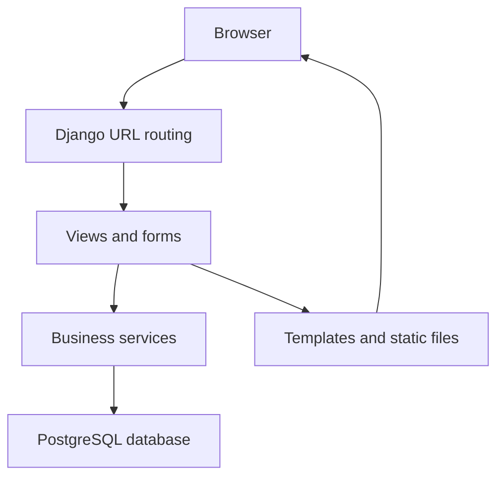
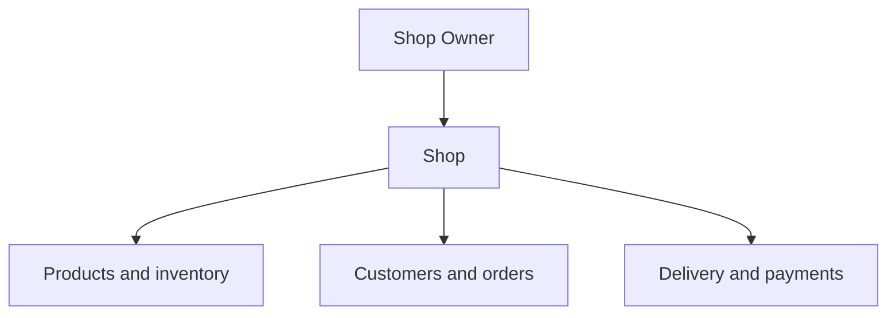

# Ordira System Architecture

This document describes the high-level technical architecture of the Ordira MVP and explains how its Django applications work together.

## 1. Architecture overview

Ordira is implemented as a Django monolith.

The frontend and backend are part of the same Django project:

- Django views process requests.
- Django forms validate submitted data.
- Service functions manage important business operations.
- Django models communicate with PostgreSQL.
- Django templates render HTML pages.
- Static CSS and JavaScript provide the user interface.

This structure is appropriate for the MVP because it keeps development, testing, deployment, and maintenance straightforward for a small team.



## 2. Technology stack

| Layer | Technology |
|---|---|
| Backend framework | Django 5.2 |
| Programming language | Python |
| Database | PostgreSQL |
| Frontend | Django Templates, HTML, CSS, JavaScript |
| Authentication | Django authentication with a custom User model |
| Configuration | Environment variables loaded from `.env` |
| Testing | Django `TestCase` and test client |
| Version control | Git and GitHub |
| Project management | Jira |
| Documentation | Markdown in the GitHub repository |

## 3. Project structure

The Django project uses the `config` package for global configuration.

```text
techtalks-ordira/
├── accounts/
├── shops/
├── products/
├── customers/
├── orders/
├── payments/
├── notifications/
├── config/
├── templates/
├── static/
├── docs/
├── manage.py
└── requirements.txt
```

Each Django application represents a separate business domain.

## 4. Django application responsibilities

### `accounts`

Responsible for:

- Custom email-based User model
- Registration
- Login and logout
- Roles
- Account statuses
- Admin approval
- User creation
- Status-enforcement middleware

Supported user roles are:

- Platform Admin
- Shop Owner

Supported account statuses are:

- Pending
- Active
- Suspended

### `shops`

Responsible for:

- Shop creation and setup
- Shop ownership
- Public shop slug
- Shop contact details
- Pickup configuration
- Currency exchange rate
- Delivery zones
- Shop payment methods
- Shop settings

The Shop acts as the primary ownership boundary for business data.

### `products`

Responsible for:

- Categories
- Products
- Product Variants
- Product images
- Prices and currencies
- Inventory quantities
- Low-stock thresholds
- Stock adjustments
- StockMovement audit records
- Public storefront product queries

### `customers`

Responsible for:

- Guest customer records
- Customer identity by shop
- Customer names and phone numbers
- Customer order relationships

Customers are not authenticated users in the current MVP.

### `orders`

Responsible for:

- Checkout and order creation
- Order numbers
- Tracking tokens
- Fulfillment type
- Delivery snapshots
- Customer snapshots
- Order statuses
- Order Items
- Cancellation and stock restoration

Important order operations should be implemented through service functions to keep transaction logic separate from views.

### `payments`

Responsible for:

- Order payments
- Payment methods
- Payment statuses
- Currency information
- Payment snapshots
- Invoices

Ordira records and tracks payments but does not process funds through an online payment gateway in the MVP.

### `notifications`

Responsible for:

- Shop Owner notifications
- New-order alerts
- Read and unread status
- Links between notifications and relevant business records

## 5. Request lifecycle

A typical authenticated request follows this sequence:

1. The browser sends an HTTP request.
2. Django matches the URL to a view.
3. Authentication middleware identifies the current user.
4. Ordira’s status middleware verifies that the user is active.
5. The view verifies ownership and permissions.
6. Forms validate submitted data when required.
7. The view or service layer performs database operations.
8. Django renders a template or returns a redirect.
9. The browser displays the response.

## 6. Authentication and authorization

Ordira uses a custom User model where email is the login field.

Authentication answers:

> Who is the current user?

Authorization answers:

> Is this user allowed to perform this operation?

Authorization is enforced using:

- Login requirements
- User role checks
- Account-status middleware
- Shop ownership checks
- Shop-scoped database queries
- POST-only protection for state-changing operations

Pending and suspended users may authenticate, but middleware redirects them away from protected application pages.

## 7. Shop-based data isolation

Most business records belong directly or indirectly to a Shop.



Views must begin by locating a shop owned by the current user.

A simplified ownership pattern is:

```python
shop = get_object_or_404(
    Shop,
    pk=shop_pk,
    owner=request.user,
)
```

Child records must then be queried through that shop.

For example, a Product should be retrieved using both its identifier and shop:

```python
product = get_object_or_404(
    Product,
    pk=product_pk,
    shop=shop,
)
```

This prevents one Shop Owner from accessing another shop’s data by manually changing a URL identifier.

## 8. Service layer

Complex business operations should be placed in service functions rather than implemented entirely inside views.

Views are responsible for:

- Receiving requests
- Checking access
- Validating forms
- Calling services
- Selecting templates or redirects
- Displaying messages

Services are responsible for:

- Business calculations
- Database transactions
- Row locking
- Creating related records
- Maintaining consistency
- Raising validation errors

For example, `products/services.py` contains the audited stock-adjustment workflow.

The order checkout workflow should follow the same pattern through `orders/services.py`.

## 9. Transaction management

Operations that update several related records must use `transaction.atomic()`.

Examples include:

- Adjusting inventory and creating a StockMovement
- Creating an Order and its Order Items
- Deducting stock during checkout
- Creating a Payment
- Creating an order notification
- Cancelling an Order and restoring stock

A transaction ensures that all related operations succeed or all are rolled back.

Ordira should never:

- Change inventory without creating its audit record.
- Create an order without its items.
- Create an order without deducting the required stock.
- Deduct stock when order creation fails.
- Restore cancelled stock more than once.

## 10. Concurrency protection

Inventory operations use database row locking with `select_for_update()`.

This is necessary when multiple requests attempt to modify the same Product Variant simultaneously.

For example, if two customers attempt to purchase the last item:

1. The first transaction locks the variant.
2. It validates and deducts the available stock.
3. The second transaction waits.
4. After acquiring the lock, the second transaction checks the updated quantity.
5. The second order is rejected if stock is no longer sufficient.

This prevents overselling.

## 11. Snapshot strategy

Historical records store snapshots of information that may change later.

Order and Order Item snapshots include:

- Customer name
- Customer phone number
- Delivery-zone name
- Delivery fee
- Product name
- Variant color
- Variant size
- Unit price
- Payment method
- Exchange rate

For example, changing a Product Variant’s price must not modify an Order Item that was created using the previous price.

Snapshots preserve the historical accuracy of orders and invoices.

## 12. Soft deletion and historical data

Categories, Products, and Product Variants use an `is_active` field where historical relationships must be preserved.

Soft deletion means:

```text
is_active = False
```

instead of permanently deleting the database row.

Archived records are excluded from active lists and normal owner workflows.

A Product Variant without historical StockMovement or Order Item records may be permanently deleted. A variant with protected history must be archived.

## 13. Template architecture

Ordira uses Django template inheritance.

`templates/base.html` provides the shared dashboard structure.

Reusable components include:

- Navbar
- Sidebar
- Footer
- Product cards
- Shared messages and layout elements

Feature templates extend the base template:

```django

```

Static assets are organized by purpose, including:

- Shared shell styles
- Storefront styles
- Product and inventory styles
- Page-specific JavaScript when required

## 14. Public and authenticated interfaces

Ordira has two main interfaces.

### Public storefront

Available without authentication:

- Landing page
- Public shop catalog
- Product details
- Cart
- Checkout
- Order success
- Order tracking

Public URLs use a Shop slug to identify the storefront.

### Owner dashboard

Requires authentication and an active Shop Owner account:

- Dashboard
- Shop settings
- Categories
- Products and variants
- Inventory
- Orders
- Customers
- Payments and invoices
- Notifications

Platform-admin pages are restricted to Admin users.

## 15. Configuration architecture

Sensitive and environment-specific values must be stored in environment variables.

Examples include:

- Django secret key
- Debug mode
- Allowed hosts
- Database name
- Database user
- Database password
- Database host
- Database port

The `.env` file must not be committed.

The `.env.example` file documents the required variables without containing real secrets.

## 16. Error handling and validation

Validation occurs at several levels:

- Form validation for user input
- Model validation for entity rules
- Service validation for business operations
- Database constraints for uniqueness and referential integrity
- Ownership checks for access control

Expected user errors should display clear messages instead of producing server errors.

Examples include:

- Insufficient inventory
- Duplicate category names
- Duplicate variant combinations
- Invalid delivery zones
- Cross-shop selections
- Invalid payment methods
- Invalid order status transitions

## 17. Testing architecture

Tests are organized inside the relevant Django applications.

The test suite covers:

- Models and constraints
- Forms and validation
- Authentication and middleware
- Ownership isolation
- Views and HTTP methods
- Inventory services
- Database transactions
- Archived-record restrictions
- Public storefront behavior
- Order and payment workflows

Tests use Django’s temporary test database and do not modify development data.

## 18. Architectural principles

The Ordira implementation follows these principles:

1. Keep business domains separated into Django applications.
2. Treat the Shop as the data-ownership boundary.
3. Validate access on the server.
4. Keep important business operations atomic.
5. Preserve historical data with snapshots and soft deletion.
6. Record every inventory change.
7. Keep complex business logic out of views.
8. Reuse shared templates and UI components.
9. Cover important behavior with automated tests.
10. Keep secrets outside source control.