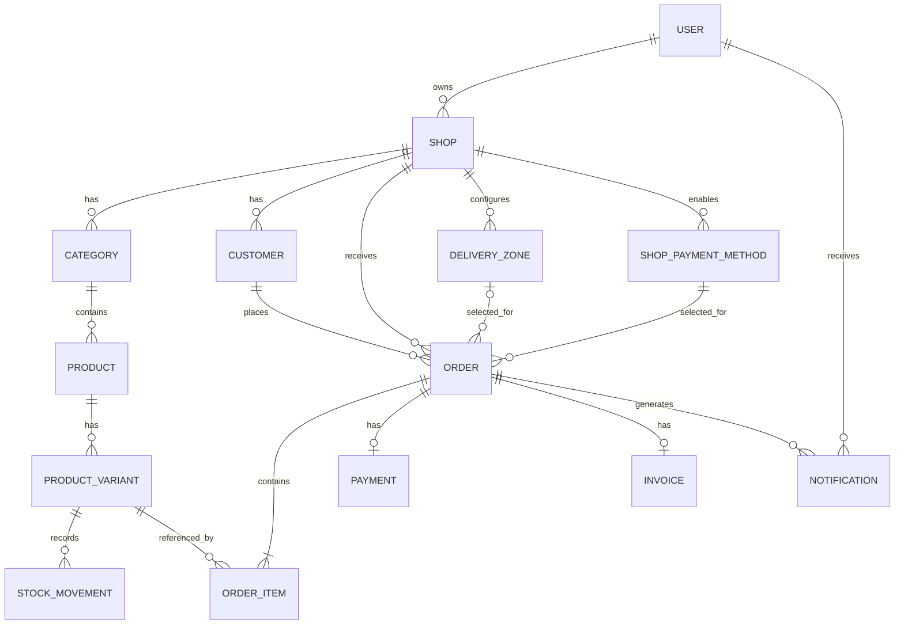

# Ordira Database Design

This document describes the main database entities, relationships, constraints, and design decisions used by Ordira.

The database schema is implemented using Django models and PostgreSQL.

## 1. Database overview

Ordira’s database is divided across the following Django applications:

| Application | Main entities |
|---|---|
| `accounts` | User |
| `shops` | Shop, Subscription, DeliveryZone, ShopPaymentMethod |
| `products` | Category, Product, ProductVariant, StockMovement |
| `customers` | Customer |
| `orders` | Order, OrderItem |
| `payments` | Payment, Invoice |
| `notifications` | Notification |

The Shop is the main data-isolation boundary. Most business records belong directly or indirectly to one Shop.

## 2. Entity relationship diagram

The following diagram represents the main Ordira database entities and relationships.


## 3. Core relationship summary



## 4. Accounts entities

### User

The custom User model represents a person who can authenticate in Ordira.

Important fields include:

- Email
- Full name
- Password hash
- Role
- Status
- Staff status
- Superuser status
- Active status

Supported roles:

- `ADMIN`
- `SHOP_OWNER`

Supported account statuses:

- `PENDING`
- `ACTIVE`
- `SUSPENDED`

Email is unique and is used as the authentication field instead of a username.

A User can own multiple Shops.

## 5. Shop entities

### Shop

A Shop represents a seller’s business.

Important fields include:

- Owner
- Name
- Slug
- WhatsApp contact
- Instagram contact
- Logo
- Pickup availability
- LBP-per-USD exchange rate
- Creation date

Relationships:

- One User can own multiple Shops.
- One Shop can contain multiple Products and Categories.
- One Shop can have multiple Customers and Orders.
- One Shop can configure multiple Delivery Zones.
- One Shop can enable multiple Payment Methods.

Constraints:

- The shop slug must be globally unique.
- The exchange rate must be greater than zero.

### Subscription

A Subscription represents a shop’s platform plan.

Important fields include:

- Shop
- Plan
- Status
- Start date
- End date

Supported plans include:

- Free
- Basic
- Premium

Supported statuses include:

- Active
- Expired
- Cancelled

One Shop may have multiple Subscription records over time.

### DeliveryZone

A DeliveryZone represents an area to which a Shop delivers.

Important fields include:

- Shop
- Area name
- Delivery fee
- Active status

Constraints:

- Area names must be unique within the same Shop.
- Delivery fees cannot be negative.

A DeliveryZone may be selected by multiple Orders.

### ShopPaymentMethod

A ShopPaymentMethod represents a payment option enabled by a Shop.

Important fields include:

- Shop
- Method name
- Enabled status

Supported methods include:

- Cash
- Whish
- OMT
- Bank Transfer

Constraints:

- A payment method can appear only once within the same Shop.

The model is stored in the `shops` application because it represents Shop configuration.

## 6. Product and inventory entities

### Category

A Category organizes Products inside one Shop.

Important fields include:

- Shop
- Name
- Active status

Constraints:

- Category names must be unique within the same Shop.

Categories use soft deletion. Archiving a Category sets:

```text
is_active = False
```

### Product

A Product stores information shared by all its purchasable variants.

Important fields include:

- Shop
- Category
- Name
- Description
- Image
- Active status

Relationships:

- One Category can contain multiple Products.
- One Product can contain multiple Product Variants.

Validation ensures that the selected Category belongs to the same Shop as the Product.

Products use soft deletion to preserve related data.

### ProductVariant

A ProductVariant represents an exact purchasable version of a Product.

Examples include:

- Black, Medium
- Black, Large
- White, Medium

Important fields include:

- Product
- Color
- Size
- Unit price
- Currency
- Stock quantity
- Low-stock threshold
- Active status

Supported currencies include:

- USD
- LBP

Constraints:

- The combination of Product, color, and size must be unique.
- Unit price cannot be negative.
- Stock quantity cannot be negative.
- Low-stock threshold cannot be negative.

A ProductVariant is considered low in stock when:

```text
stock_quantity <= low_stock_threshold
```

Product Variants with historical records are archived instead of permanently deleted.

### StockMovement

A StockMovement provides an inventory audit trail.

Important fields include:

- Product Variant
- User who created the movement
- Signed quantity change
- Reason
- Creation date and time

Supported reasons include:

- Sale
- Restock
- Adjustment
- Cancellation
- Damage

A positive quantity increases stock. A negative quantity decreases stock.

The ProductVariant relationship uses protected deletion so inventory history cannot be accidentally removed.

## 7. Customer entity

### Customer

A Customer represents a guest customer belonging to a specific Shop.

Important fields include:

- Shop
- Full name
- Phone number

Constraints:

- A phone number must be unique within the same Shop.

A customer is not an authenticated User.

The same person may appear as separate Customer records in different Shops. This keeps each Shop’s customer history isolated.

One Customer can place multiple Orders.

## 8. Order entities

### Order

An Order connects the Shop, Customer, fulfillment information, payment selection, totals, and status.

Important fields include:

- Shop
- Customer
- Delivery Zone
- Selected Payment Method
- Order number
- Tracking token
- Fulfillment type
- Status
- Customer name snapshot
- Customer phone snapshot
- Delivery-zone name snapshot
- Delivery-fee snapshot
- Address snapshot
- Items total
- Final total
- Currency
- Exchange-rate snapshot
- Cancellation reason
- Stock restoration date
- Creation date

Supported fulfillment types:

- `DELIVERY`
- `PICKUP`

Supported statuses:

- `NEW`
- `PREPARING`
- `HANDED_TO_DELIVERY`
- `COMPLETED`
- `CANCELLED`

Constraints:

- Order numbers must be unique.
- Tracking tokens must be unique.
- Monetary totals cannot be negative.
- The exchange-rate snapshot must be greater than zero.
- The Customer must belong to the selected Shop.
- The Payment Method must belong to the selected Shop.

Delivery orders require:

- A Delivery Zone belonging to the selected Shop
- A delivery address

Pickup orders require:

- No Delivery Zone
- A zero delivery fee

Cancelled Orders require a cancellation reason.

The `stock_restored_at` field prevents stock from being restored more than once.

### OrderItem

An OrderItem represents one Product Variant purchased in an Order.

Important fields include:

- Order
- Product Variant
- Product-name snapshot
- Size snapshot
- Color snapshot
- Unit-price snapshot
- Quantity
- Line total

Constraints:

- Quantity must be at least one.
- Unit price and line total cannot be negative.
- The Product Variant must belong to the same Shop as the Order.

One Order contains one or more Order Items.

The ProductVariant relationship uses protected deletion to preserve order history.

## 9. Payment entities

### Payment

A Payment stores the payment information associated with an Order.

Important fields include:

- Order
- Payment Method
- Amount
- Currency
- Amount in the Order’s currency
- Payment-method name snapshot
- Received date
- Status

Supported statuses:

- `PENDING`
- `PAID`

Constraints:

- One Order can have at most one Payment in the current MVP.
- Payment amounts cannot be negative.
- The Payment Method must belong to the Order’s Shop.

Order status and Payment status are independent.

### Invoice

An Invoice stores a financial snapshot for an Order.

Important fields include:

- Shop
- Order
- Invoice number
- Issue date
- Subtotal snapshot
- Delivery-fee snapshot
- Total snapshot
- Currency
- Status

Supported statuses:

- `DRAFT`
- `ISSUED`
- `VOID`

Constraints:

- Invoice numbers must be unique.
- One Order can have at most one Invoice.
- The Invoice and Order must belong to the same Shop.
- Monetary snapshot values cannot be negative.

## 10. Notification entity

### Notification

A Notification informs a User about an important platform or Shop event.

Notifications may represent events such as:

- A new Order
- An Order status update
- Low inventory
- Account or administrative events

A Notification records:

- Its recipient
- Its related event or record
- Its message
- Its read or unread status
- Its creation time

One User can receive multiple Notifications, and one Order may generate multiple Notifications during its lifecycle.

## 11. Historical snapshots

Orders store snapshots instead of relying only on current related data.

Snapshots include:

- Customer name
- Customer phone number
- Delivery-zone name
- Delivery fee
- Delivery address
- Product name
- Variant color
- Variant size
- Unit price
- Payment-method name
- Currency
- Exchange rate

For example, if a Product Variant costs `$10` when ordered and later changes to `$12`, the existing Order Item must continue showing `$10`.

Snapshots ensure that completed and historical Orders remain accurate.

## 12. Deletion behavior

Django relationship deletion rules protect important data.

### Cascade deletion

Used when child records have no meaning without their parent.

Examples:

- Deleting an Order deletes its Order Items.
- Deleting a Shop may delete its Shop-specific configuration where permitted.

### Protected deletion

Used when historical records must remain valid.

Examples:

- A ProductVariant referenced by StockMovement cannot be deleted.
- A ProductVariant referenced by OrderItem cannot be deleted.
- A Shop referenced by an Order cannot be deleted.
- A Customer referenced by an Order cannot be deleted.
- A Payment Method referenced by an Order cannot be deleted.

### Set null

Used when the historical record should remain even if an optional related record is removed.

For example:

- An Order’s DeliveryZone reference may become null while the saved zone-name and fee snapshots remain.
- A StockMovement’s creator may become null while the movement remains in the audit history.

## 13. Main database constraints

| Entity | Constraint |
|---|---|
| User | Email is unique |
| Shop | Slug is unique |
| DeliveryZone | Shop and area name are unique together |
| ShopPaymentMethod | Shop and method name are unique together |
| Category | Shop and category name are unique together |
| ProductVariant | Product, color, and size are unique together |
| Customer | Shop and phone number are unique together |
| Order | Order number is unique |
| Order | Tracking token is unique |
| Payment | One Payment per Order |
| Invoice | One Invoice per Order |
| Invoice | Invoice number is unique |
| OrderItem | Quantity must be at least one |
| Monetary fields | Values cannot be negative |
| Stock fields | Values cannot be negative |

## 14. Migration strategy

Database changes are tracked through Django migrations.

Developers should run:

```powershell
python manage.py makemigrations
python manage.py migrate
```

Before committing model changes, verify that no migration is missing:

```powershell
python manage.py makemigrations --check --dry-run
```

Migrations must be committed with the model changes that require them.

## 15. Data-integrity strategy

Ordira protects data integrity using:

- Foreign-key relationships
- Unique constraints
- Minimum-value validators
- Model validation
- Form validation
- Shop ownership checks
- Database transactions
- Row locking
- Historical snapshots
- Soft deletion
- Protected deletion
- Automated tests

Together, these rules ensure that Shop data remains isolated, inventory remains traceable, and historical Orders remain accurate.