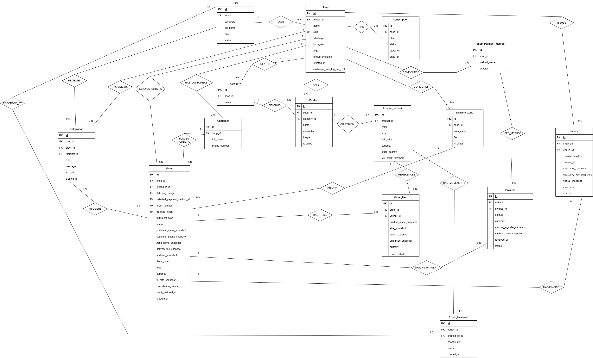

# SCRUM-36 — Final ERD and Database Implementation

**Owner:** Reem Saijary<br>
**Sprint:** Sprint 2<br>
**Date:** September 16, 2026<br>
**Status:** Completed and merged<br>
**Related ticket:** SCRUM-36<br>
**Branch:** `feature/scrum-36-erd-models`<br>
**Target branch:** `develop`

---

## 1. Objective

The objective of SCRUM-36 was to convert the approved Ordira Entity Relationship Diagram into Django models and create the initial PostgreSQL database schema.

The implementation establishes the data foundation for:

- Shop ownership and data isolation
- Products, variants, and inventory
- Guest customer records
- Orders and order items
- Delivery zones
- Shop payment methods
- Payments and invoices
- Notifications
- Shop subscriptions

## Final ERD



## 2. Final Database Entities

The final ERD contains 15 main entities:

### Accounts

1. **User**
    - Represents Platform Admins and Shop Owners.
    - Uses email for authentication.
    - Stores the user’s role and account status.

### Shops

1. **Shop**
    - Represents a seller’s business.
    - Belongs to a User.
    - Acts as the main data-isolation boundary.
2. **Subscription**
    - Stores the shop’s subscription plan, status, and dates.
3. **DeliveryZone**
    - Stores the areas supported by a shop and their current delivery fees.
4. **ShopPaymentMethod**
    - Stores the payment methods enabled by each shop, such as Cash, Whish, OMT, and Bank Transfer.

### Products and inventory

1. **Category**
    - Organizes products inside a specific shop.
2. **Product**
    - Stores general product information such as name, description, image, category, and availability.
3. **ProductVariant**
    - Represents a purchasable version of a product.
    - Stores color, size, price, currency, stock quantity, and low-stock threshold.
4. **StockMovement**
    - Records inventory changes such as sales, restocking, adjustments, cancellations, and damaged stock.

### Customers

1. **Customer**
    - Represents a guest customer belonging to a particular shop.
    - Stores the customer’s general name and phone number.

### Orders

1. **Order**
    - Connects the shop, customer, delivery zone, payment selection, totals, and order status.
2. **OrderItem**
    - Represents one purchased product variant inside an order.
    - Stores historical snapshots of product details and price.

### Payments

1. **Payment**
    - Stores the order’s selected payment method, amount, currency, and payment status.
    - Each order can have at most one Payment in the current MVP.
2. **Invoice**
    - Stores an invoice snapshot for an order.
    - Each order can have at most one Invoice.

### Notifications

1. **Notification**
    - Stores notifications sent to users for events such as new orders, order updates, and low stock.

---

## 3. Main Relationships

- One User can own multiple Shops.
- One Shop can have multiple Subscriptions.
- One Shop can have multiple Delivery Zones.
- One Shop can enable multiple Shop Payment Methods.
- One Shop can have multiple Categories.
- One Category can contain multiple Products.
- One Product can contain multiple Product Variants.
- One Product Variant can have multiple Stock Movements.
- One Shop can have multiple Customers.
- One Customer can place multiple Orders.
- One Shop can receive multiple Orders.
- One Order can contain multiple Order Items.
- Each Order Item references one Product Variant.
- One Delivery Zone can be selected by multiple Orders.
- One Shop Payment Method can be selected by multiple Orders.
- One Order can have one Payment.
- One Order can have one Invoice.
- One Order can generate multiple Notifications.
- One User can receive multiple Notifications.

---

## 4. Important Design Decisions

### Shop-based data isolation

Most business data belongs directly or indirectly to a Shop. This prevents one Shop Owner from accessing another shop’s products, customers, orders, or payment configuration.

### Guest customers

Customers do not need platform accounts. A Customer record is created or reused using the customer’s phone number within a specific shop.

The same person can therefore exist as a separate Customer in different shops without mixing order histories.

### Product variants

Price and stock are stored on ProductVariant rather than Product because different colors and sizes may have different prices and availability.

### Historical snapshots

Orders and Order Items store snapshots of important checkout information, including:

- Customer name and phone number
- Delivery-zone name and fee
- Delivery address
- Product name
- Color and size
- Unit price
- Line total
- Currency and exchange rate

This ensures that previous orders remain historically accurate when current product prices, customer details, or delivery fees change.

### Payment method location

ShopPaymentMethod was placed in the `shops` app because it represents shop configuration.

This also avoids creating a circular migration dependency between the `orders` and `payments` apps.

### One payment per order

Payment uses a one-to-one relationship with Order because partial payments are outside the current MVP scope.

### Inventory audit trail

StockMovement stores signed inventory changes and their reasons, providing an audit trail for stock updates.

### Cancellation support

Order includes:

- `cancellation_reason`
- `stock_restored_at`

These fields support cancellation history and help ensure stock is restored only once.

The complete cancellation service and status-transition enforcement will be implemented in a later business-logic ticket.

---

## 5. Database Constraints

The implementation includes the following important constraints:

- Shop slug must be unique.
- A delivery-zone name must be unique within its shop.
- A payment method can only appear once per shop.
- A customer phone number must be unique within its shop.
- A category name must be unique within its shop.
- A product variant’s product, color, and size combination must be unique.
- Order numbers must be unique.
- Order tracking tokens must be unique.
- Each order can have at most one Payment.
- Each order can have at most one Invoice.
- Monetary values use minimum-value validators.
- Order-item quantities must be at least one.
- Product stock and low-stock thresholds cannot be negative.

Model validation was also added to verify important cross-shop relationships, delivery/pickup requirements, and cancellation information.

---

## 6. Django Implementation by App

### `shops`

Implemented:

- Shop
- Subscription
- DeliveryZone
- ShopPaymentMethod

### `products`

Implemented:

- Category
- Product
- ProductVariant
- StockMovement

### `customers`

Implemented:

- Customer

### `orders`

Implemented:

- Order
- OrderItem

### `payments`

Implemented:

- Payment
- Invoice

### `notifications`

Implemented:

- Notification

### `accounts`

The existing custom User model is used for authentication, roles, account statuses, shop ownership, stock-movement authors, and notification recipients.

---

## 7. Media Configuration

Image support was configured for:

- Shop logos in `media/shop_logos/`
- Product images in `media/product_images/`

The following were also completed:

- Added `MEDIA_URL`
- Added `MEDIA_ROOT`
- Configured media serving during local development
- Added Pillow to `requirements.txt`
- Kept the `media/` directory ignored by Git

The uploaded file path is stored in PostgreSQL, while the physical image is stored inside the media directory during local development.

---

## 8. Migrations

Initial migrations were created for:

- `shops`
- `customers`
- `products`
- `orders`
- `payments`
- `notifications`

The dependency order is:

**Accounts/User → Shops → Customers and Products → Orders → Payments and Notifications**

The migrations were successfully applied to the local PostgreSQL database, creating all required tables and constraints.

Other developers can create the same tables in their local databases by pulling the updated `develop` branch and running:

```powershell
python -m pip install -r requirements.txt
python manage.py migrate
```

They do not need to recreate the initial migrations.

---

## 9. Validation Performed

The implementation was validated using:

```powershell
python manage.py check
```

Result:

```
System check identified no issues
```

Migration consistency was checked using:

```powershell
python manage.py makemigrations --check --dry-run
```

Result:

```
No changes detected
```

The migrations were also applied successfully to PostgreSQL, and the generated tables were verified through pgAdmin.

---

## 10. Documentation Updates

The project README was updated with:

- PostgreSQL migration instructions
- Django configuration verification commands
- A summary of the database schema
- Media-file storage information

---

## 11. Scope Clarification

SCRUM-36 implemented the database structure, relationships, constraints, migrations, and supporting configuration.

The following application behavior is not part of this schema ticket and will be implemented in later tickets:

- Transactional order-creation service
- Concurrent stock locking and deduction
- Automatic stock-movement creation
- Cancellation and one-time stock restoration service
- Order-status transition enforcement
- Automatic Payment, Invoice, and Notification creation
- Views, forms, dashboards, and customer checkout interfaces
- Automated model and workflow tests

---

## 12. Final Result

The approved Ordira ERD has been successfully translated into Django models and PostgreSQL tables.

The schema is now merged into `develop` and provides the database foundation required for the next authentication, shop-management, catalog, checkout, payment, and notification tasks.